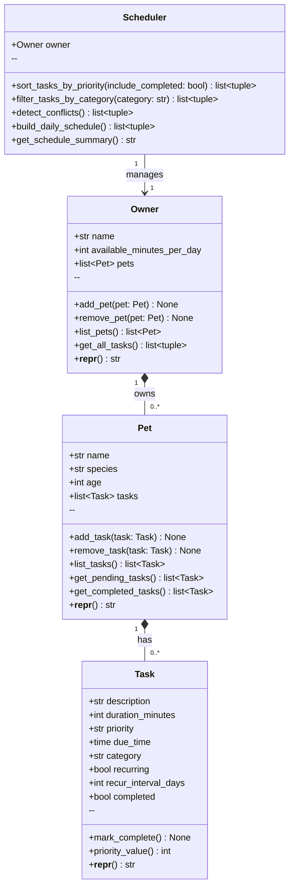

# PawPal+ UML Class Diagram

## Relationship notes

| Relationship | Type | Meaning |
|---|---|---|
| `Owner` → `Pet` | Composition (`*--`) | Pets belong to one Owner; Owner manages their lifecycle |
| `Pet` → `Task` | Composition (`*--`) | Tasks belong to one Pet; Pet manages their lifecycle |
| `Scheduler` → `Owner` | Association (`-->`) | Scheduler operates on an Owner but does not own it |
